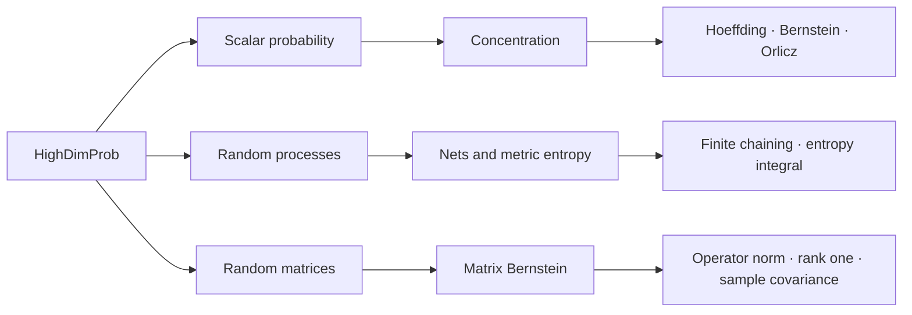

# HighDimProb

#### High-dimensional probability and finite-dimensional random matrices in Lean 4

[English](README.md) | [简体中文](README_zh.md)

[](https://github.com/dududuguo/HighDimProb/actions/workflows/ci.yml)
[](https://dududuguo.github.io/HighDimProb/)

[](LICENSE)

HighDimProb is a Mathlib-based Lean 4 library for concentration inequalities,
metric entropy, random processes, and finite-dimensional random matrices. It
provides focused imports, compiled examples, API tests, and an append-only
Judge suite so that formalized results can be used and audited downstream.

[API overview](docs/user/APIOverview.md) ·
[Examples](HighDimProb/Examples/) ·
[Documentation](docs/README.md) ·
[Interactive roadmap](docs/visualizations/roadmap.html) ·
[Contributing](CONTRIBUTING.md)

## TL;DR

HighDimProb provides composable Lean APIs for high-dimensional probability,
random processes, and random-matrix theory, so users can quickly build
end-to-end formal proofs with explicit assumptions and inspectable intermediate
steps, keeping mathematical black boxes to a minimum. It is not limited to
machine learning: any field that relies on this mathematics can use it.

## Library overview

| Area | Recommended import | Includes |
|---|---|---|
| Scalar probability | `HighDimProb` | Objects, expectation, tails, moments, variance, Orlicz vocabulary, and typed statements. |
| Concentration | `HighDimProb.Concentration` | Markov, Chebyshev, MGF routes, Orlicz–tail–moment implications, Rademacher, Hoeffding, Bernstein, and finite Hanson-Wright. |
| Metric entropy and processes | `HighDimProb.SubGaussianProcess` and focused concentration imports | Nets, covering and packing, parent maps, finite chaining, finite suprema, and entropy-integral bounds. |
| Random matrices | `HighDimProb.RandomMatrix` | Finite matrices, Loewner order, spectral tools, trace exponential, sums, and variance proxies. |
| Matrix concentration | `HighDimProb.RandomMatrix.Concentration` | Trace-MGF, Matrix Bernstein, operator norm, centered rank-one, and sample covariance routes. |
| Development aggregate | `HighDimProb.Experimental` | Broad opt-in import for modules under active development. |

## Representative results

| Lean API | Result | Reference or usage |
|---|---|---|
| `HighDimProb.hoeffding_sum_bounded` | Classical two-sided Hoeffding inequality for finite independent bounded sums. | [Hoeffding's inequality](https://en.wikipedia.org/wiki/Hoeffding%27s_inequality) · [Judge case](HighDimProbJudge/Concentration/HoeffdingUse.lean) |
| `HighDimProb.bernstein_sum_subExponential` | Two-sided Bernstein min-form bound for independent centered sub-exponential sums. | [Source](HighDimProb/Concentration/Bernstein.lean) · [Judge case](HighDimProbJudge/Concentration/BernsteinUse.lean) |
| `HighDimProb.packingCoveringInequality` | The standard comparison between packing and covering numbers at related scales. | [Nets example](HighDimProb/Examples/NetsUsage.lean) |
| `HighDimProb.expect_abs_sub_dyadic_path_le_truncatedEntropyIntegral` | Finite dyadic chaining controlled by a truncated covering-number entropy integral. | [Empirical-process example](HighDimProb/Examples/EmpiricalProcessNetUsage.lean) |
| `HighDimProb.dudleyEntropyIntegral` | Anchored Dudley entropy-integral bound over a totally bounded index set, under explicit regularity and integrability assumptions. | [Source](HighDimProb/Concentration/Dudley.lean) · [API test](HighDimProbTest/DudleyAPI.lean) |
| `HighDimProb.l1Ball`, `HighDimProb.coveringNumber_euclideanBall_le`, `HighDimProb.coveringNumber_l1Ball_le` | Volumetric internal covering bounds: `ceil((1 + 2R/eps)^card)` for Euclidean balls and `ceil((1 + 4R/eps)^card)` for l1-balls, with `R >= 0`, `eps > 0`, and a finite nonempty index. The l1 bound uses `B1 ⊆ B2` (`l1Ball` inside the Euclidean closed ball) and Mathlib subset comparison, not the sharper Maurey estimate. | [Source](HighDimProb/Geometry/CoveringNumber.lean) · [API test](HighDimProbTest/CoveringNumberAPI.lean) · [Facade](HighDimProb/Geometry.lean) |
| `HighDimProb.MatrixBernstein.operatorNormTail_of_primitives` | A self-adjoint Matrix Bernstein operator-norm tail bound from explicit primitives. | [RandomMatrix API](docs/user/RandomMatrixAPI.md) |
| `HighDimProb.MatrixBernstein.sampleCovarianceExactRow` | A centered sample-covariance route with an exact row-variance identity. | [Sample-covariance example](HighDimProb/Examples/RandomMatrix/SampleCovarianceTailUsage.lean) |
| `HighDimProb.HansonWright.hanson_wright_inequality_hdp` | Finite real-matrix Hanson-Wright two-sided tail for the centered quadratic form under explicit coordinate sub-Gaussian MGF bounds; no matrix symmetry premise. | [Source](HighDimProb/Concentration/HansonWright.lean) · [API test](HighDimProbTest/HansonWrightAPI.lean) |

Exact theorem names and hypotheses are indexed in the
[theorem atlas](docs/reference/TheoremAtlas.md) and the generated
[API documentation](https://dududuguo.github.io/HighDimProb/).

## Getting started

The repository currently tracks Lean and Mathlib `v4.29.1`.

### Build the library

```bash
git clone https://github.com/dududuguo/HighDimProb.git
cd HighDimProb
lake exe cache get
lake build
lake test
```

### Use HighDimProb as a dependency

Add the package to your `lakefile.toml`:

```toml
[[require]]
name = "HighDimProb"
git = "https://github.com/dududuguo/HighDimProb"
rev = "main"
```

Then import the smallest surface needed by your proof:

```lean
import HighDimProb.Concentration
import HighDimProb.RandomMatrix.Concentration
```

The root `import HighDimProb` intentionally contains only `Init`, `Scalar`,
and `Statements`; larger theorem families use focused imports.

## Proof routes



The [interactive roadmap](docs/visualizations/roadmap.html) expands these
routes into their dependencies and source modules. More proof diagrams and the
Lean import graph are collected in
[`docs/visualizations/`](docs/visualizations/index.md).

## Examples and documentation

The examples compile with the library and are written as downstream code:

- [Basic usage](HighDimProb/Examples/BasicUsage.lean)
- [Orlicz feature extraction](HighDimProb/Examples/OrliczFeatureUsage.lean)
- [Epsilon nets and metric entropy](HighDimProb/Examples/NetsUsage.lean)
- [Empirical-process nets and finite chaining](HighDimProb/Examples/EmpiricalProcessNetUsage.lean)
- [Random-matrix statement routes](HighDimProb/Examples/RandomMatrix/StatementRoutes.lean)
- [Sample-covariance tail bounds](HighDimProb/Examples/RandomMatrix/SampleCovarianceTailUsage.lean)

Start with the [documentation index](docs/README.md) for guided reading, or
open the [RandomMatrix API](docs/user/RandomMatrixAPI.md) for the supported
matrix surface and its exact assumptions.

## Contributing

Search Mathlib before adding infrastructure, keep imports narrow, and add a
compiled test for each public API. Contributions must not use `sorry`,
`admit`, new axioms, or placeholder theorem bodies.

```bash
python .github/scripts/check_text_quality.py
python scripts/judge_policy_check.py
lake build HighDimProbJudge
lake test
```

Judge files registered in `.github/judge-lock.json` are immutable; new public
coverage is added as a new leaf. See [CONTRIBUTING.md](CONTRIBUTING.md) for the
complete workflow.

## License and acknowledgements

HighDimProb is available under the [Apache License 2.0](LICENSE). Thanks to
[@freezed-corpse-143](https://github.com/freezed-corpse-143) for contributions
to the project.
