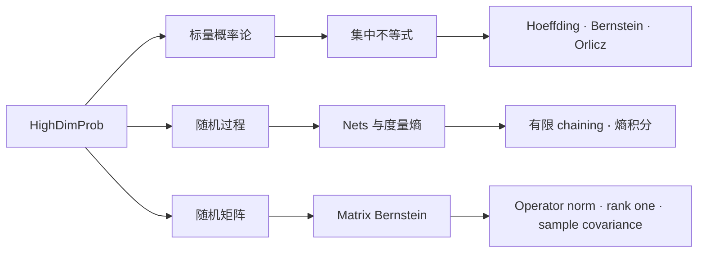

# HighDimProb

#### 用 Lean 4 形式化高维概率与有限维随机矩阵理论

[English](README.md) | [简体中文](README_zh.md)

[](https://github.com/dududuguo/HighDimProb/actions/workflows/ci.yml)
[](https://dududuguo.github.io/HighDimProb/)

[](LICENSE)

HighDimProb 是一个基于 Mathlib 的 Lean 4 库，主要处理集中不等式、度量熵、
随机过程和有限维随机矩阵。仓库提供专门的 import、可编译示例、API 测试，以及
只增不改的 Judge 回归套件，方便下游直接使用和核对形式化结果。

[API 总览](docs/user/APIOverview.md) ·
[使用示例](HighDimProb/Examples/) ·
[文档](docs/README.md) ·
[交互路线图](docs/visualizations/roadmap.html) ·
[参与贡献](CONTRIBUTING.md)

## TL;DR

HighDimProb 提供高维概率、随机过程和随机矩阵的可组合 Lean API，目标是快速构建端到端、可检查、尽量无黑盒的数学证明。它不局限于机器学习，也适用于任何依赖这部分数学的领域。

## 库的主要内容

| 方向 | 推荐 import | 包含内容 |
|---|---|---|
| 标量概率论 | `HighDimProb` | 基础对象、期望、尾概率、矩、方差、Orlicz 语言和类型化 statements。 |
| 标量集中不等式 | `HighDimProb.Concentration` | Markov、Chebyshev、MGF 路线、Orlicz／tail／moment 蕴含、Rademacher、Hoeffding 和 Bernstein。 |
| 度量熵与随机过程 | `HighDimProb.SubGaussianProcess` 及相关 concentration imports | Nets、covering／packing、parent maps、有限 chaining、有限 supremum 和熵积分界。 |
| 随机矩阵 | `HighDimProb.RandomMatrix` | 有限矩阵、Loewner 序、谱工具、trace exponential、矩阵和与 variance proxies。 |
| 矩阵集中不等式 | `HighDimProb.RandomMatrix.Concentration` | Trace-MGF、Matrix Bernstein、operator norm、中心化 rank-one 和 sample covariance 路线。 |
| 开发聚合入口 | `HighDimProb.Experimental` | 按需一次性导入开发中的模块。 |

## 结果

| Lean API | 结果 | 参考或用法 |
|---|---|---|
| `HighDimProb.hoeffding_sum_bounded` | 有限个独立有界随机变量之和的经典双侧 Hoeffding 不等式。 | [Hoeffding 不等式](https://en.wikipedia.org/wiki/Hoeffding%27s_inequality) · [Judge 用例](HighDimProbJudge/Concentration/HoeffdingUse.lean) |
| `HighDimProb.bernstein_sum_subExponential` | 独立、中心化次指数随机变量之和的双侧 Bernstein min-form 界。 | [源码](HighDimProb/Concentration/Bernstein.lean) · [Judge 用例](HighDimProbJudge/Concentration/BernsteinUse.lean) |
| `HighDimProb.packingCoveringInequality` | Packing number 与 covering number 在相邻尺度上的标准比较。 | [Nets 示例](HighDimProb/Examples/NetsUsage.lean) |
| `HighDimProb.expect_abs_sub_dyadic_path_le_truncatedEntropyIntegral` | 用截断 covering-number 熵积分控制有限 dyadic chaining。 | [经验过程示例](HighDimProb/Examples/EmpiricalProcessNetUsage.lean) |
| `HighDimProb.dudleyEntropyIntegral` | 在显式正则性与可积性假设下，给出全有界索引集上的锚定 Dudley 熵积分界。 | [源码](HighDimProb/Concentration/Dudley.lean) · [API 测试](HighDimProbTest/DudleyAPI.lean) |
| `HighDimProb.l1Ball`、`HighDimProb.coveringNumber_euclideanBall_le`、`HighDimProb.coveringNumber_l1Ball_le` | 体积法内部 covering bound：Euclidean 球为 `ceil((1 + 2R/eps)^card)`，l1 球为 `ceil((1 + 4R/eps)^card)`；条件为 `R >= 0`、`eps > 0` 及有限非空指标。l1 界通过 `B1 ⊆ B2`（`l1Ball` 包含于 Euclidean 闭球）和 Mathlib 的子集比较得到，不是更尖锐的 Maurey 估计。 | [源码](HighDimProb/Geometry/CoveringNumber.lean) · [API 测试](HighDimProbTest/CoveringNumberAPI.lean) · [Facade](HighDimProb/Geometry.lean) |
| `HighDimProb.MatrixBernstein.operatorNormTail_of_primitives` | 从显式基础假设推出自伴 Matrix Bernstein 的 operator-norm 尾界。 | [RandomMatrix API](docs/user/RandomMatrixAPI.md) |
| `HighDimProb.MatrixBernstein.sampleCovarianceExactRow` | 带精确 row-variance 恒等式的中心化 sample-covariance 路线。 | [Sample-covariance 示例](HighDimProb/Examples/RandomMatrix/SampleCovarianceTailUsage.lean) |

精确的 theorem 名称和假设可以在
[Theorem Atlas](docs/reference/TheoremAtlas.md)和生成的
[API 文档](https://dududuguo.github.io/HighDimProb/)中查询。

## 开始使用

仓库目前使用 Lean 和 Mathlib `v4.29.1`。

### 编译仓库

```bash
git clone https://github.com/dududuguo/HighDimProb.git
cd HighDimProb
lake exe cache get
lake build
lake test
```

### 作为依赖使用

在项目的 `lakefile.toml` 中加入：

```toml
[[require]]
name = "HighDimProb"
git = "https://github.com/dududuguo/HighDimProb"
rev = "main"
```

然后按证明需要选择最小的 import：

```lean
import HighDimProb.Concentration
import HighDimProb.RandomMatrix.Concentration
```

根入口 `import HighDimProb` 有意保持精简，只包含 `Init`、`Scalar` 和
`Statements`；其他 theorem family 使用各自的专门 import。

## 证明路线



[交互路线图](docs/visualizations/roadmap.html)会继续展开每条路线的依赖和源码模块。
其他证明路线图与 Lean import graph 收录在
[`docs/visualizations/`](docs/visualizations/index.md)。

## 示例与文档

这些示例会随库一起编译，写法尽量接近真实的下游代码：

- [基础用法](HighDimProb/Examples/BasicUsage.lean)
- [Orlicz feature 提取](HighDimProb/Examples/OrliczFeatureUsage.lean)
- [Epsilon nets 与度量熵](HighDimProb/Examples/NetsUsage.lean)
- [经验过程的 nets 与有限 chaining](HighDimProb/Examples/EmpiricalProcessNetUsage.lean)
- [随机矩阵 statement 路线](HighDimProb/Examples/RandomMatrix/StatementRoutes.lean)
- [Sample-covariance 尾界](HighDimProb/Examples/RandomMatrix/SampleCovarianceTailUsage.lean)

第一次阅读可以从[文档索引](docs/README.md)开始；如果关注随机矩阵，直接查看
[RandomMatrix API](docs/user/RandomMatrixAPI.md)即可找到支持的接口和精确假设。

## 参与贡献

开始前先搜索 Mathlib，import 尽量精确，并为新增公共 API 加上可编译测试。
贡献中不能使用 `sorry`、`admit`、新公理或占位 theorem body。

```bash
python .github/scripts/check_text_quality.py
python scripts/judge_policy_check.py
lake build HighDimProbJudge
lake test
```

已经登记在 `.github/judge-lock.json` 中的 Judge 文件不可修改；新增公共覆盖需要
放在新的 leaf 中。完整流程见 [CONTRIBUTING.md](CONTRIBUTING.md)。

## 许可证与致谢

HighDimProb 使用 [Apache License 2.0](LICENSE)。感谢
[@freezed-corpse-143](https://github.com/freezed-corpse-143) 对项目的贡献。
