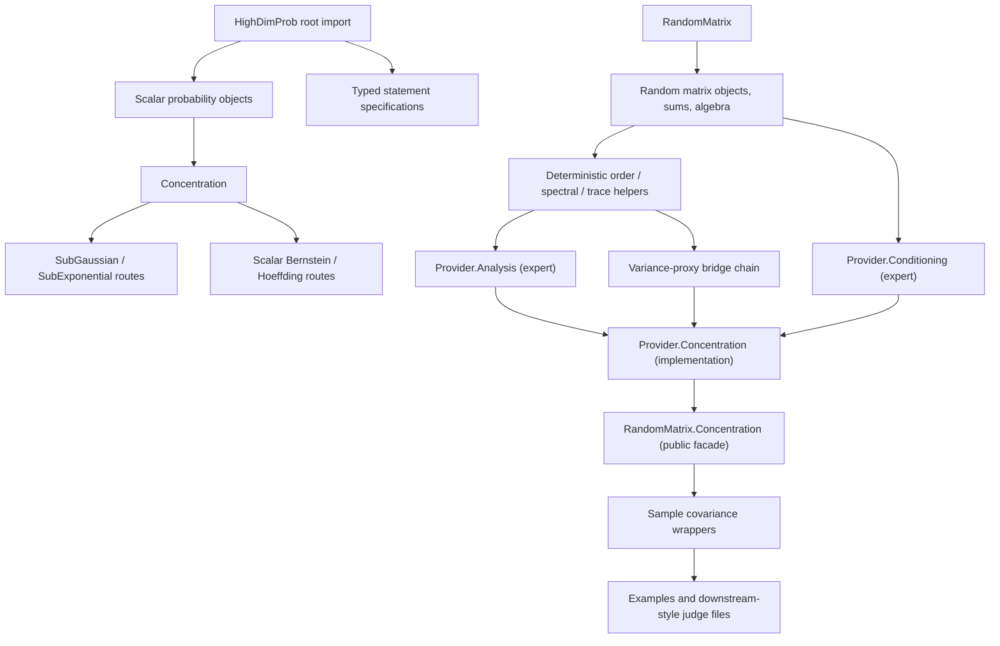

# HighDimProb API Overview

This page is a stable route map for the public API. It follows the same
principle as Mathlib module documentation: use short module-level explanations,
name the main entry points, and leave exact theorem signatures to source,
doc-gen, tests, and `#check`.

Do not treat this page as a complete theorem index. Use it to choose the right
module and example first, then inspect the referenced API file or generated
documentation for exact arguments.

## Import Layers

```text
import HighDimProb
  stable scalar probability object layer and typed statement specifications

import HighDimProb.Concentration
  scalar concentration theorem families

import HighDimProb.RandomMatrix
  supported finite-dimensional random-matrix base and statement surface

import HighDimProb.RandomMatrix.Concentration
  public trace-MGF, tail, Matrix Bernstein, and sample-covariance surface

import HighDimProb.RandomMatrix.Provider.Analysis
  expert deterministic matrix analysis and Lieb/Epstein proof infrastructure

import HighDimProb.RandomMatrix.Provider.Conditioning
  expert conditional-expectation and natural-history proof infrastructure

import HighDimProb.RandomMatrix.Provider.Concentration
  internal concentration assembly re-exported by RandomMatrix.Concentration

import HighDimProb.RandomMatrix.Provider
  broad expert provider facade; prefer a narrower layer when possible

import HighDimProb.Experimental
  broad work-in-progress aggregate beyond the supported focused scopes

import HighDimProb.Examples
  usage examples and smoke tests, not part of the stable root import
```

The root import is intentionally narrow. A focused module may have a supported
theorem contract while remaining outside `import HighDimProb`. Downstream
matrix-concentration users should normally import
`HighDimProb.RandomMatrix.Concentration`; the `Provider.*` imports expose
internal/expert proof boundaries. Experimental status is reserved for unfinished
surfaces beyond the documented assumptions and module boundaries. The public
facade does not erase hypotheses: primitive, measurability, integrability,
independence, radius, variance-proxy, and parameter-domain assumptions remain
explicit where required by each theorem.

## Route Diagram



## Stable Reader Path

For a first pass through the repository:

1. Read [`Status.md`](Status.md) for the current state.
2. Read [`TODO.md`](TODO.md) for active next work.
3. Use [`TermMap.md`](TermMap.md) to find the relevant area.
4. Read the focused API page, such as
   [`RandomMatrixAPI.md`](RandomMatrixAPI.md), for public names and caveats.
5. Open the corresponding example under `HighDimProb/Examples`.
6. Use generated docs, [`LeanTooling.md`](LeanTooling.md), or `#check` for exact Lean signatures.

This is deliberately close to Mathlib practice: route documentation is
conceptual, while exact declarations are checked by the Lean compiler.

## Main API Areas

| Area | Import | Main docs | Example surface |
|---|---|---|---|
| Stable scalar objects | `HighDimProb` | [`ModuleTree.md`](ModuleTree.md) | smoke/API tests |
| Scalar concentration | `HighDimProb.Concentration` | source modules, tests, and judge files | concentration tests/judge |
| Random matrices | `HighDimProb.RandomMatrix` | [`RandomMatrixAPI.md`](RandomMatrixAPI.md) | `HighDimProb/Examples/RandomMatrix` |
| Matrix concentration | `HighDimProb.RandomMatrix.Concentration` | [`TheoremAtlas.md`](TheoremAtlas.md) and [`RandomMatrixAPI.md`](RandomMatrixAPI.md) | tests and judge files |
| Sample covariance routes | `HighDimProb.RandomMatrix.Concentration` | [`RandomMatrixAPI.md`](RandomMatrixAPI.md) | `SampleCovarianceTailUsage` |
| Expert provider development | narrow `HighDimProb.RandomMatrix.Provider.*` import | [`RandomMatrixArchitecture.md`](RandomMatrixArchitecture.md) | provider API tests |
| External-facing checks | `HighDimProbJudge` | [`JudgeSystem.md`](JudgeSystem.md) | judge files |

## RandomMatrix Route Map

The RandomMatrix layer has a supported finite-dimensional core and explicit
provider boundaries.

```text
Basic / Algebra / MatrixOrder
  vocabulary, matrix algebra, Loewner order, PSD/self-adjoint facts

Sums
  random-matrix finite sums, prefix/suffix bookkeeping, natural-state helpers

OperatorNorm / Spectral / UnitSphere
  deterministic operator-norm and spectral event bridges

TraceExp
  trace-exponential vocabulary, Tropp finite-family and conditional-step routes

VarianceProxy
  matrix variance proxy, deterministic norm control, rank-one providers

HardboneStatements
  named hard theorem targets and thin consumers that expose current blockers

ConcentrationStatements
  Matrix Bernstein and sample-covariance wrappers under explicit primitives

Provider.Analysis (expert/internal)
  deterministic calculus, resolvents, relative entropy, Lieb/Epstein, Golden--Thompson

Provider.Conditioning (expert/internal)
  kernels, conditional expectation, and natural-history bridges

Provider.Concentration (expert/internal implementation)
  integrability, trace-MGF, tail, and Matrix Bernstein assembly

RandomMatrix.Concentration
  public facade over the documented matrix-concentration theorem surface
```

Use the named helpers in [`RandomMatrixAPI.md`](RandomMatrixAPI.md) instead of
copying unfolded right-hand sides into examples or tests.

## Recommended RandomMatrix Entry Points

For downstream matrix-concentration use, begin with
`import HighDimProb.RandomMatrix.Concentration`.

| Use case | Start here | What remains explicit |
|---|---|---|
| Generic quadratic-form Matrix Bernstein | `matrixBernsteinQuadTail_opt_of_tropp` | Tropp/Lieb trace-MGF primitives, integrability, variance proxy |
| Generic operator-norm Matrix Bernstein | `matrixBernsteinOpNormTail_opt_of_tropp` | positive threshold, positive/negative Tropp primitives, variance proxies |
| Sample covariance quadratic-form tail | `SampleCovarianceTailUsage.sampleCovariance_quadraticForm_tail_usage` | independence, integrability, Tropp primitive |
| Sample covariance operator-norm tail | `SampleCovarianceTailUsage.sampleCovariance_operatorNorm_tail_usage` | positive/negative primitive assumptions |
| Generated-history exact-row sample covariance | `MatrixBernstein.sampleCovarianceExactRow` / `MatrixBernstein.sampleCovarianceExactRowHighProbability` | matrix measurability, coordinate `MemLp 2`, uniform and row-specific squared-norm bounds, independence, and parameter-domain hypotheses |
| Lower-level exact-row positive-side route | `sampleCovariance_quadraticForm_tail_optimized_under_exactRowSqNorm_bound_of_troppPrimitive` | hardbone sharp-chain premise, Tropp primitive, integrability |
| Bridge-layer exact-row centered-square route | `SampleCovarianceExactRowCenteredSquareTroppAssumptions` and `SampleCovarianceExactRowCenteredSquareTwoSidedTroppAssumptions` | centered-square-chain provider premises, negative-side adapters, Tropp primitives, integrability |

`MatrixBernstein.sampleCovarianceExactRow` is the preferred row-specific tail
endpoint; `MatrixBernstein.sampleCovarianceExactRowHighProbability` evaluates
it at the canonical threshold divided by the row count. They remove explicit
Tropp, matrix-exponential integrability, trace-exponential integrability, and
negative-family assumptions. The generic `iIndepFun_centeredRankOne` adapter
transfers independence of the original random vectors to the centered
outer-product family. The older exact-row centered-square wrappers remain public
compatibility infrastructure.

## What Is Not Claimed

The current Matrix Bernstein surface does not claim:

- an automatic arbitrary-history or unconditional finite-family Tropp chain;
- automatic trace-exp integrability;
- automatic hardbone sharp-variance-chain providers;
- full unconditional Matrix Bernstein;
- sample-covariance concentration without measurability, moment, boundedness,
  independence, and parameter-domain hypotheses.

Golden--Thompson is a separate closed deterministic endpoint:
`HighDimProb.goldenThompsonTraceExp` proves the exact
`goldenThompsonTraceExp_statement` under its self-adjoint hypotheses.

When the remaining facts appear in theorem statements, they should be visible
as named premises or named assumption bundles.

## Documentation Rules

- Keep this overview stable and route-level.
- Put exact theorem-family status in [`TheoremAtlas.md`](TheoremAtlas.md).
- Put concrete public names and import paths in
  [`RandomMatrixAPI.md`](RandomMatrixAPI.md).
- Put short active next tasks in [`TODO.md`](TODO.md).
- Put current branch status in [`Status.md`](Status.md).
- Put usage demonstrations in examples, not in long prose.
